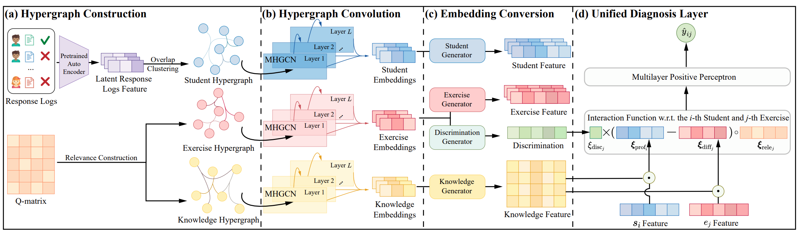

<div align='center'>
<h1>Capturing Homogeneous Influence among Students: Hypergraph Cognitive Diagnosis for Intelligent Education Systems</h1>
<a href='https://www.jhshen.cn/'>Junhao Shen</a>, <a href='https://faculty.ecnu.edu.cn/_s16/qh_en/main.psp'>Hong Qian*</a>, <a href='https://scholar.google.com/citations?user=sRoqbLwAAAAJ&hl=en'>Shuo Liu</a>, <a href='https://faculty.ecnu.edu.cn/_s16/zw2_en_6444/main.psp'>Wei Zhang</a>, <a href='https://faculty.ecnu.edu.cn/_s8/jb2_en/main.psp'>Bo Jiang</a>, and <a href='https://faculty.ecnu.edu.cn/_s16/zam_en/main.psp'>Aimin Zhou</a>. (*Correspondence )

<a href='https://aiedu.ecnu.edu.cn/'>Shanghai Institute of AI Education</a>, <a href='http://www.cs.ecnu.edu.cn/'>School of Computer Science and Technology</a>, East China Normal Universit

<a href='https://hypercdm.kdd24.jhshen.cn/'></a>
<a href='https://drive.google.com/file/d/1kEv0dEOGmPdD625LS3Y1q5PAkB71PHl-/view'></a>


</div>

This repository contains the code for the paper "Capturing Homogeneous Influence among Students: Hypergraph Cognitive Diagnosis for Intelligent Education Systems" published in proceedings of the 30th SIGKDD Conference on Knowledge Discovery and Data Mining (KDD 2024). We also upload the pre-print full paper, titled `full paper.pdf` in the folder named asset. 

## 📰 News 
- [x] [2024.5.17] This work is accepted by KDD 2024 (20% acceptance rate) with the average score 5.5 out of 7.0.
- [x] [2024.4.8] We upload all datasets (including NeurIPS2020, EdNet-1, ASSISTment17 and Junyi) during the evaluation process, which can be used to reproduce the results of experiment.
- [x] [2024.2.2] We upload the source code of HyperCDM and metrics implementation.

## 💻 Getting Started

### File Tree
```
HyperCDM
│  DOA.py
│  homogeneity.py
│  main.py
│  README.md
│
├─asset
│      framework.png
│      full paper.pdf
│
└─data
    ├─a17
    │      a17TotalData.csv
    │      config.json
    │      q.csv
    │
    ├─EdNet-1
    │      config.json
    │      EdNet-1TotalData.csv
    │      q.csv
    │
    ├─junyi
    │      config.json
    │      junyiTotalData.csv
    │      q.csv
    │
    ├─Math1
    │      config.json
    │      Math1TotalData.csv
    │      q.csv
    │
    └─nips20
            config.json
            nips20TotalData.csv
            q.csv
```

### Quick Start
We provide Math1 as sample datasets to validate the HyperCDM. You can reproduce the results by directly running `main.py`, i.e.
```
python main.py
```

### Run with other datasets
#### Step 1. prepare dataset
Refer to the sample dataset, you should prepare the following files:
```
├─dataset
│  └─Your_dataset
│          config.json
│          data.csv   
│          q.csv
```
Specifically, `config.json` records all necessary settings of dataset like the number of students, and the format of config.json is shown as following:
```
{
  "dataset": [String, the name of the dataset],
  "q_file": [string, the relative path of Q matrix],
  "data": [string, the relative path of response logs],
  "student_num": [int, the number of students],
  "exercise_num": [int, the number of exercises],
  "knowledge_num": [int, the number of knowledge concepts]
}
```

`data.csv` consists of response logs in the following format:
```
[int, student_id1],[int, question_id1],[0/1, response to question_id1]
[int, student_id1],[int, question_id2],[0/1, response to question_id2]
...
[int, student_idn],[int, question_idm],[0/1, response to question_idm]
```

`q.csv` contains the relevant between questions and knowledge attributes. Each entry in the $i$-th row and the $j$-th column means
whether the $i$-th question involves the $j$-th knowledge attributes.

#### Step 2. coding
Refer to the `main.py`, you can change the path to different configuration file.

#### Step 3. run code
```
python main.py
```

### Necessary Packages
```
pytorch 1.13.0+cu0.11
scikit-learn 1.1.2
pandas 1.3.2
scipy 1.9.1
```

## 📞 Contact
Should you have any questions and commemtns, post an issue here, or feel free to contact [Junhao Shen](mailto:shenjh@stu.ecnu.edu.cn) (first author) and [Hong Qian](mailto:hqian@cs.ecnu.edu.cn) (correspondence author).

## 📄 Citation
If you find HyperCDM is helpful and and can inspire you in your reseach or applications, please kindly cite as follows.

**BibTex**
```
@inproceedings{Shen2024hypercdm,
 author = {Shen, Junhao and 
           Qian, Hong and
           Liu, Shuo and
           Zhang, Wei and
           Jiang, Bo and 
           Zhou, Aimin},
 booktitle = {Proceedings of the 30th {SIGKDD} Conference on Knowledge Discovery and Data Mining},
 title = {Capturing Homogeneous Influence among Students: Hypergraph Cognitive Diagnosis for Intelligent Education Systems},
 year = {2024},
 address = {Barcelona, Spain},
 page = {}
}
```

**ACM Format**

Junhao Shen, Hong Qian, Shuo Liu, Wei Zhang, Bo Jiang, and Aimin Zhou. 2024. Capturing Homogeneous Influence among Students: Hypergraph Cognitive Diagnosis for Intelligent Education Systems. In _Proceedings of
the 30th ACM SIGKDD Conference on Knowledge Discovery and Data Mining_, Barcelona, Spain.


